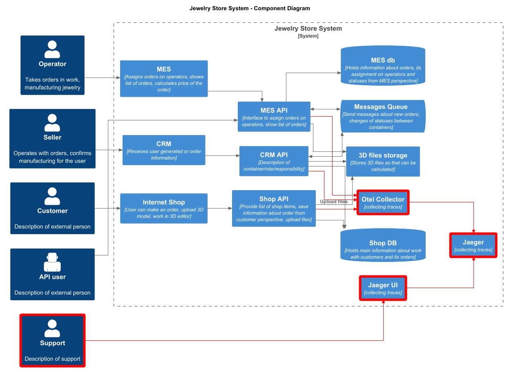

# Архитектурное решение по трейсингу

Трейсинг позволяет определить, на каком этапе обработки был потерян или завис запрос. Поскольку внедрение трейсинга в приложения обычно не представляет сложности (достаточно настроить стандартный HTTP-middleware), предлагается реализовать его для всех сервисов системы.

## Данные

* TraceID
* List of Spans
* Временные метки (timespans) начала/завершения

Для каждого Span:
* SpanID
* ParentSpanID
* Timespans
* url
* http-method
* Operation status (ok, error)
* User name
* Source service
* Target service

## Мотивация
 * Быстрая диагностика проблем в распределённой системе
 * Выявление узких мест, влияющих на производительность запросов
 * Оперативное устранение проблем благодаря точной локализации
 
## Предлагаемое решение
 * Развернуть Jaeger (систему трейсинга)
 * Развернуть Elasticsearch в качестве хранилища
 * Настроить интеграцию Jaeger с Elasticsearch
 * Развернуть OpenTelemetry Collector (для сбора трейсов)
 * Настроить взаимодействие OpenTelemetry с Jaeger
 * Интегрировать отправку трейсов из приложений в OpenTelemetry Collector

 
## Компромиссы
 * Преимущества от внедрения трейсинга гораздо выше стоимости внедрения трейсинга в пока ещё небольшую систему, считаю что в нашем случае компромисов нет.

## Безопасность.
 * OpenTelemetry, Jaeger и Elasticsearch должны работать во внутреннем контуре без доступа извне
 * Реализовать аутентификацию для доступа к Jaeger UI
 * Настроить ролевую модель (RBAC), ограничивающую доступ к просмотру трейсов 
 