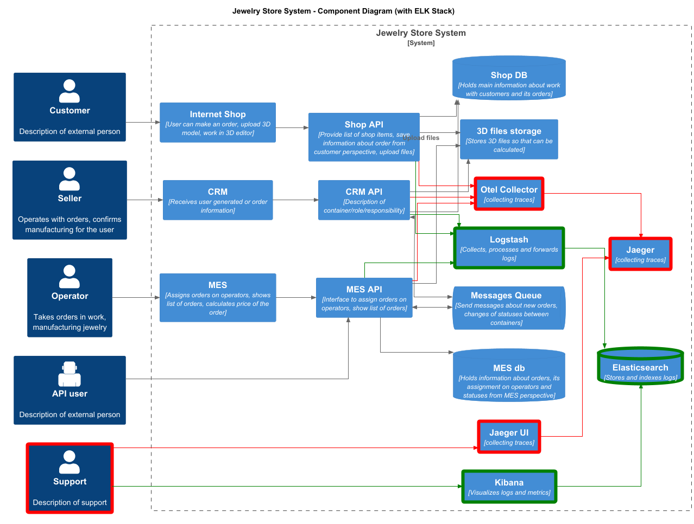

# Архитектурное решение по логированию

## Список логов:

 * Изменение статусов заказов
 * Начало вычисления стоимости изделия
 * Завершение вычисления стоимости изделия
 * Загрузка файлов
 * Начало/завершение вызовов API-методов
 * Логирование посылки/получения сообщений из очереди

## Мотивация

### Логирование, в дополнение к трейсингу, может помочь:

 * Понять причины возникновения ошибок в системе - анализируя последовательность событий и параметры запросов;
 * Удостовериться в корректности реализованной логики изменения статусов заказов - отслеживая переходы между статусами и время нахождения в каждом состоянии;
 * Выявить узкие места производительности - фиксируя время выполнения операций;
 * Обнаружить аномальные сценарии работы - идентифицируя неожиданные последовательности действий или параметров;
 * Воспроизвести проблемные ситуации - благодаря сохранению хронологии событий;
 * Оптимизировать бизнес-процессы - анализируя реальные временные затраты на каждом этапе;
 * Улучшить взаимодействие между компонентами системы - отслеживая корректность передачи данных между модулями;
 * Сформировать доказательную базу - при возникновении спорных ситуаций с клиентами или партнерами;
 * Автоматизировать мониторинг ключевых метрик - создавая алерты на основе анализа логов;
 * Проводить ретроспективный анализ - изучая исторические данные для выявления скрытых проблем.

### Примеры метрик

| Тип метрики       | Метрика                          | Источник данных       | Как поможет бизнесу                                                                 |
|-------------------|----------------------------------|-----------------------|------------------------------------------------------------------------------------|
| **Технические**   | Время ответа API (`/calculate_price`) | Логи API             | Выявит перегрузку API и точки отказа, улучшит стабильность B2B-интеграций          |
|                   | Задержки в очереди MQ            | Логи очереди (RabbitMQ/Kafka) | Покажет, теряются ли заказы при интеграции с партнёрами                           |
|                   | Время перехода между статусами   | Логи MES + CRM        | Обнаружит "бутылочные горла" (например, зависание в `PRICE_CALCULATED`)           |
|                   | Время загрузки дашборда MES      | Логи MES              | Ускорит работу операторов за счёт оптимизации медленных запросов                  |
| **Бизнес-метрики** | % заказов с нарушением SLA       | Логи статусов (CRM+MES) | Поможет скорректировать сроки производства и прогнозировать нагрузку              |
|                   | Количество "потерянных" заказов  | Сравнение логов (API → MQ → CRM) | Уменьшит жалобы клиентов и потерю контрактов                                     |
|                   | Среднее время производства       | Логи статусов MES      | Позволит точнее рассчитывать сроки для клиентов                                  |
|                   | Соотношение B2B/B2C заказов      | Логи источников заказов | Поможет оценить эффективность новых каналов сбыта                                |

### Приоритизация:

Приоритет стоит отдать компонентам, наиболее критичным для бизнеса и основным источникам проблем:

1. `MES`. Так как это основная проблемная система с наибольшими задержками, такими как вычисление стоимости и тормозами дашборда;
2. `API для партнёров`, так как именно с его открытием выросли проблемы в работе системы;
3. `CRM`. По остаточному принципу =)

## Предлагаемое решение

### Для реализации логирования предлагается использовать ELK-стек:

* Elasticsearch – хранение и индексация
* Logstash – обработка логов
* Kibana – визуализация и анализ

### Политика безопасности

* Как и в случае с трейсами, доступ до ELK должен быть только из внутреннего контура без доступа извне;
* Аутентификация в кибану с разными уровнями доступа: разработчикам полный доступ для возможности тюнинга системы, поддержке только на чтение.
* Насторить маскировку чувствительных данных, таких как пароли пользователей, емайлы и телефоны

### Политика хранения

 * Логи, относящиеся к заказам необходимо хранить как можно дольше, и при ротации можно их дополнительно сохранять в том же S3-хранилище;
 * Ошибки и предупреждения можно хранить не так долго, так как они нужны в основном только во время разбора инцидента. 

### Мероприятия по превращению системы сбора логов в систему анализа логов

 * Настройка алертинга:
   * Зависшие заказы (заказ не переходит в статус PRICE_CALCULATED в течении 2х часов)
   * Аномальный рост количества заказов 
   * Рост количества 5xx ошибок
 * Поиск аномалий
   * Аномальный рост количества заказов
   * Долгие операции
   * Некорректный формат загруженных файлов

### C4-диаграмма 

