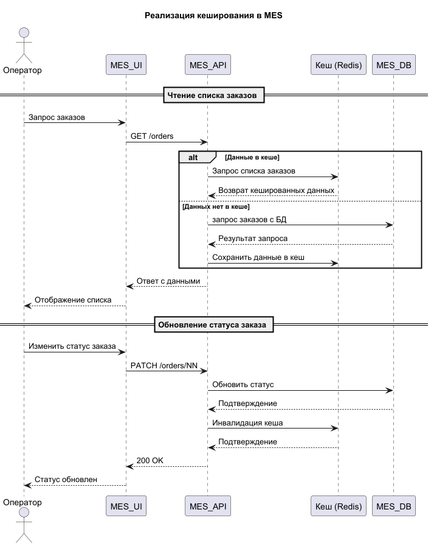

# Архитектурное решение по кешированию

## Мотивация

Внедрение кеширования снизит нагрузку на базу данных и улучшит стабильность API. Так как самым слабым звеном в системе видится `MES`, то с его кеширования и начнём, а именно с API для получения списка заказов.

## Предлагаемое решение

### Выбор стратегии кеширования

Предлагается использовать серверное кеширование реализованное на основе паттерна Cache-Aside, так как:

* Данные нужны разным клиентам
* Нужно централизированное управление инвалидацией
* Cache-Aside простой в реализации и позволяет быстро получить приемлемые результаты

### Выбор стратегии инвалидации данных

| Стратегия                           | Анализ                                                                                                     |
|-------------------------------------|------------------------------------------------------------------------------------------------------------|
| Временная инвалидация               | Подходит для нашего случая, позволяет нивилировать ошибки в рабое других алгоритмов инвалидации            |
| Инвалидация, основанная на запросах | Не подходит, так как некоторые статусы, например "PRICE_CALCULATED", выставляются системой, а не через API |
| Программная инвалидация             | Подходит, инвалидируем кеш при любом изменении статуса                                                     |
| Инвалидация по ключу                | Не подходит, так как мы сразу кешируем список статусов заказов, а не отдельный заказ.                      |

В итоге останавливаемя на двух стратегиях: `временная` и `программная` инвалидации.

## Диаграмма последовательности

